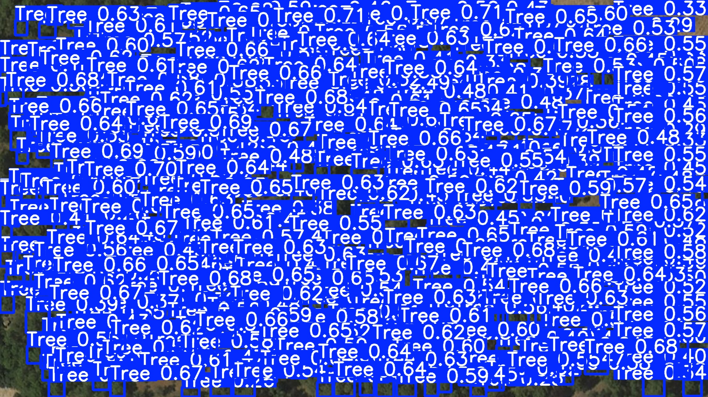
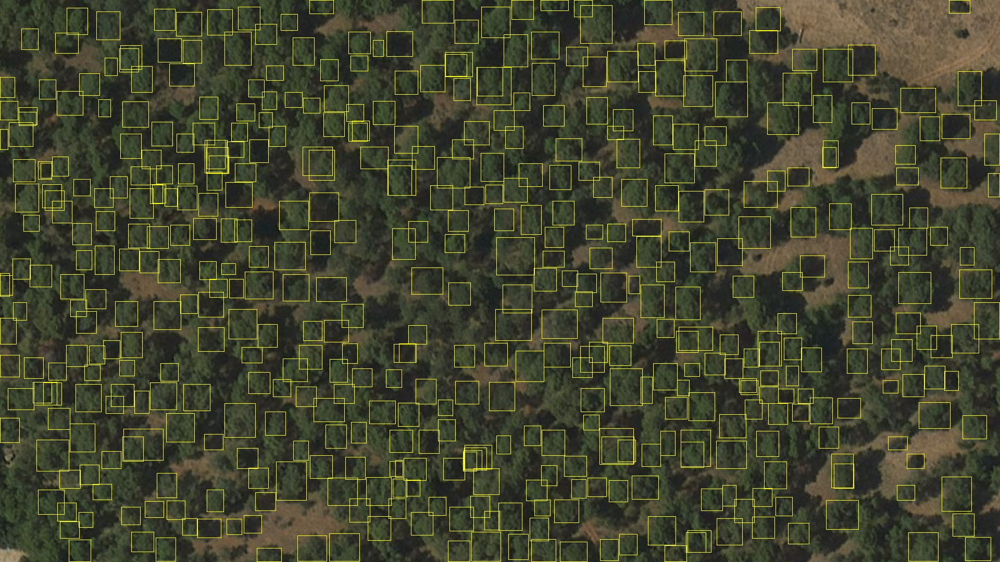
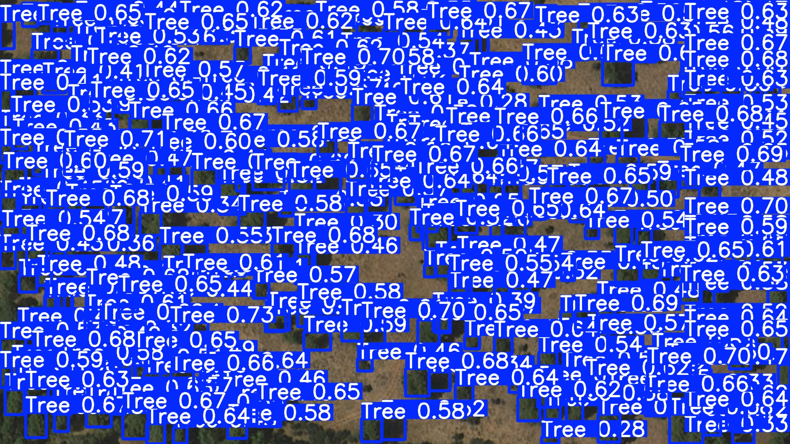
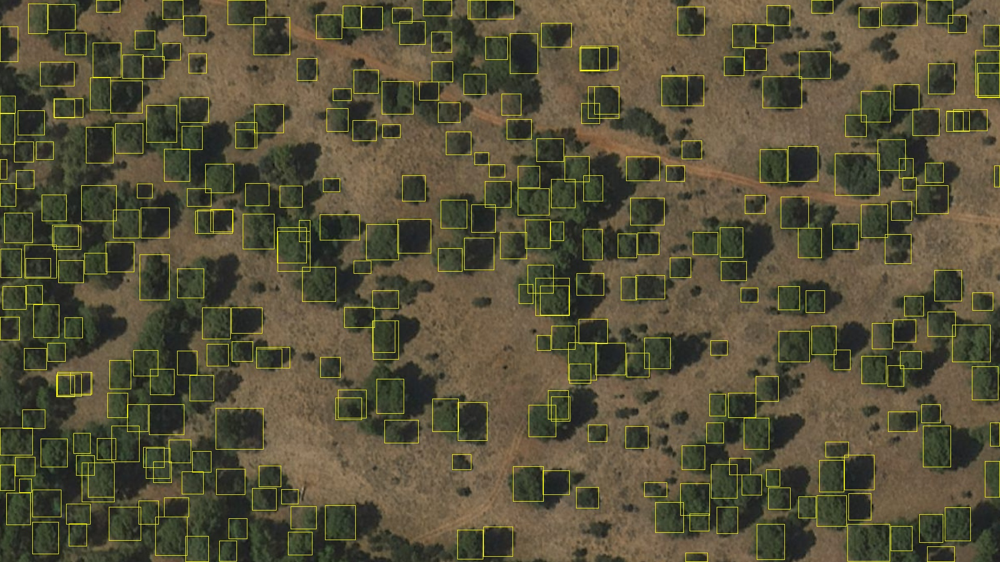
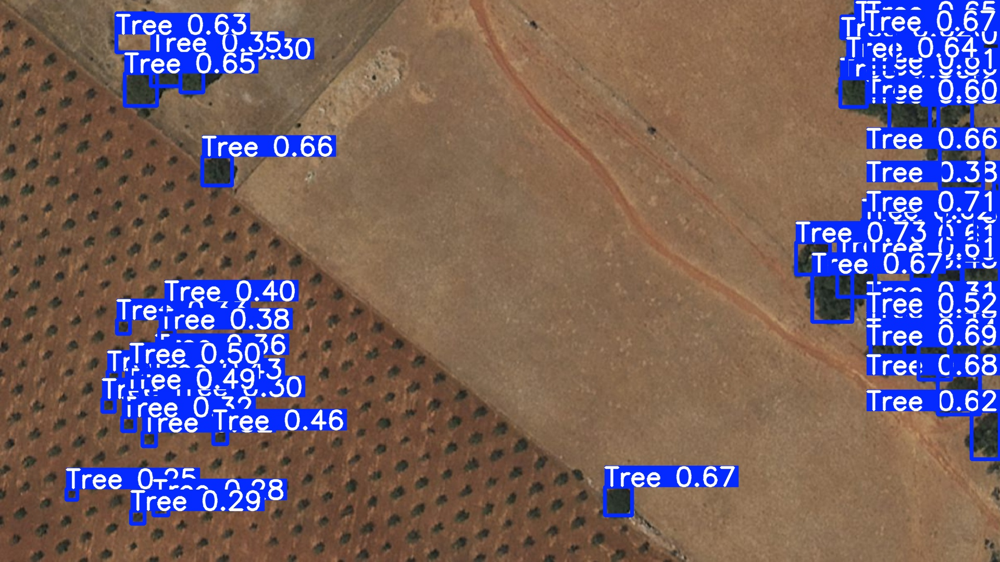
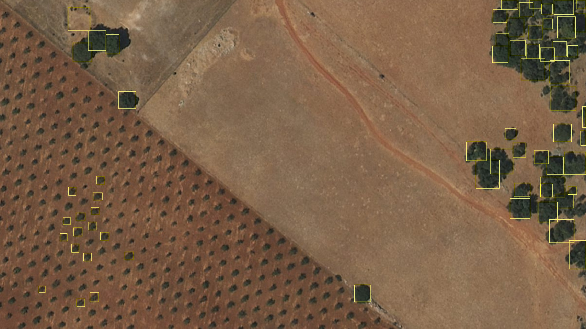

# Generación de un mapa virtual de densidad forestal y biomasa mediante teledetección e IA

Repositorio asociado al Trabajo Fin de Grado:

**Generación de un mapa virtual de densidad forestal y biomasa residual mediante teledetección e IA para la identificación de zonas de alto riesgo de incendio**

**Autor:** Álvaro Cabañas Sánchez  
**Titulación:** Grado en Ingeniería de Tecnologías de Telecomunicación  
**Centro:** Escuela Politécnica Superior de Linares — Universidad de Jaén  
**Dirección:** Antonio J. Muñoz Montoro y Julio José Carabias Orti

## Descripción

Este repositorio reúne el material necesario para documentar y reproducir las principales fases experimentales del TFG desarrollado en el entorno del monte Peña de Quesada (Jaén).

El trabajo combina:

- detección automática de arbolado mediante YOLO;
- ajuste fino con un conjunto de datos local anotado;
- ortofotografía aérea PNOA;
- información altimétrica LiDAR;
- georreferenciación de detecciones;
- deduplicación espacial;
- estimación experimental de biomasa aérea;
- análisis de sensibilidad al umbral de confianza;
- análisis espacial mediante unidades no solapadas.

El objetivo del repositorio no es proporcionar un inventario forestal validado mediante trabajo de campo, sino conservar de forma trazable el flujo computacional, las entradas propias, las configuraciones y los resultados utilizados en la memoria.

## Zona y datos de estudio

El área experimental corresponde a una extensión de 4 × 4 km en el entorno de Peña de Quesada, equivalente a 1600 ha, dentro del sistema de referencia ETRS89 / UTM zona 30N (EPSG:25830).

Las principales fuentes empleadas son:

- ortofotografía PNOA de 0,25 m/píxel;
- información LiDAR-PNOA;
- raster de altura de vegetación de 1 m/píxel;
- cartografía forestal externa utilizada como referencia;
- conjunto local de 19 imágenes anotadas para detección de árboles.

Los datos geoespaciales de gran tamaño no se incluyen directamente en Git. Su estructura y procedencia se documentan en `data/external/README.md`.

## Detector de arbolado

El modelo de partida es un YOLOv8m preentrenado sobre el conjunto de datos VHRTrees.

Los metadatos del checkpoint original utilizado en el TFG indican:

- arquitectura YOLOv8m;
- clase `Tree`;
- `imgsz = 960`;
- 50 épocas;
- batch 16;
- optimizador `auto`.

Este modelo se utilizó como baseline y posteriormente se ajustó con el conjunto local de Peña de Quesada.

La configuración principal del entrenamiento definitivo fue:

- `imgsz = 1280`;
- batch 2;
- 20 épocas;
- GPU NVIDIA GeForce RTX 3050 Ti Laptop GPU.

El modelo operativo seleccionado corresponde al `best.pt` del entrenamiento definitivo en GPU.

SHA-256 del modelo final:

`378149D7CAE0C04FDD8EED5BA4FA606DFE72FE8AEA444C26AF8F665BA89EB25E`

El modelo final utilizado en el análisis territorial se incluye como `models/best.pt`. La procedencia del modelo de partida y la información completa de los checkpoints se documentan en `models/README.md`.

## Ejemplos visuales

A continuación se muestran ejemplos representativos obtenidos con el modelo final
`models/best.pt` y un umbral de confianza `conf = 0,25`.

Para cada nivel de densidad se conserva la salida original de YOLO, con cajas,
clase y confianza, y una representación alternativa mediante cajas amarillas sin
etiquetas.

| Densidad | Salida YOLO | Cajas amarillas |
| --- | --- | --- |
| Alta |  |  |
| Media |  |  |
| Baja |  |  |

El repositorio conserva además el script
`scripts/visualization/pintar-cajas-amarillo-comparativa-conf.py`
para generar este tipo de representación sobre las detecciones territoriales.

Las imágenes corresponden a la partición de validación del conjunto local. La
descripción completa de estas evidencias se encuentra en
`data/examples/README.md`.

## Resultados principales

La evaluación se realizó sobre cinco imágenes de validación que contienen conjuntamente 1266 anotaciones de referencia.

Con IoU >= 0,50:

| Configuración | Precisión | Recall | F1 |
| --- | ---: | ---: | ---: |
| Baseline, conf 0,25 | 0,227 | 0,137 | 0,171 |
| CPU ajustado, conf 0,25 | 0,459 | 0,451 | 0,455 |
| GPU ajustado, conf 0,25 | 0,427 | 0,482 | 0,453 |
| GPU ajustado, conf 0,40 | 0,517 | 0,406 | 0,455 |

Con IoU >= 0,30, el modelo GPU ajustado con `conf = 0,25` alcanzó:

- precisión: 0,594;
- recall: 0,670;
- F1: 0,630.

La mejora principal procede del fine-tuning con imágenes locales. El empleo de GPU aporta fundamentalmente una mejora computacional.

### Comparativa territorial homogénea

La inferencia territorial se repitió con cuatro umbrales manteniendo constante el resto de la configuración:

- `conf = 0,10`;
- `conf = 0,15`;
- `conf = 0,20`;
- `conf = 0,25`;
- `imgsz = 1280`;
- `max_det = 3000`;
- IoU de NMS = 0,70.

Resultados principales del escenario de coníferas:

| Confianza | Detecciones únicas | Detecciones usadas | Biomasa total (t) | Biomasa (t/ha arbolada) |
| --- | ---: | ---: | ---: | ---: |
| 0,10 | 79 077 | 61 373 | 19 316,476 | 43,254 |
| 0,15 | 67 030 | 51 692 | 16 297,666 | 36,494 |
| 0,20 | 58 695 | 45 025 | 14 274,414 | 31,963 |
| 0,25 | 52 128 | 39 845 | 12 684,980 | 28,404 |

La superficie arbolada efectiva determinada mediante el criterio LiDAR de altura entre 2 y 40 m es de 446,586 ha.

El intervalo de biomasa anterior representa un análisis de sensibilidad frente al umbral del detector y no un intervalo de confianza estadístico. No se selecciona ningún umbral como óptimo al no disponer de un ground truth territorial independiente.

## Estructura del repositorio

`data/dataset/`  
Conjunto local de entrenamiento y validación con imágenes y etiquetas YOLO.

`data/evaluation_predictions/`  
Predicciones congeladas utilizadas para reproducir la evaluación TP/FP/FN.

`data/external/`  
Documentación y ubicación esperada de los datos PNOA y LiDAR externos.

`models/`  
Documentación de los checkpoints utilizados y sus identificadores SHA-256.

`scripts/evaluation/`  
Evaluación TP/FP/FN y análisis de resultados.

`scripts/inference/`  
Inferencia territorial homogénea para los cuatro umbrales.

`scripts/georeferencing/`  
Conversión de detecciones a coordenadas UTM y extracción de información LiDAR.

`scripts/biomass/`  
Cálculo de biomasa y análisis por unidades espaciales.

`scripts/visualization/`  
Representación de cajas y generación de figuras.

`results/`  
Resultados congelados utilizados como referencia en la memoria.

`training/final_gpu/`  
Configuración, métricas y curvas del entrenamiento definitivo.

`docs/`  
Documentación específica de entornos y reproducibilidad.

`outputs/`  
Directorio local para resultados regenerados. Está excluido del historial Git.

## Reproducción rápida

La evaluación del detector puede reproducirse directamente con el contenido incluido en el repositorio:

`python .\scripts\evaluation\evaluar_tp_fp_fn.py`

Después:

`python .\scripts\evaluation\analizar_resultados_tp_fp_fn.py`

Los nuevos resultados se escriben en `outputs/evaluation/` y no modifican los resultados congelados almacenados en `results/detector_evaluation/`.

Las figuras finales pueden regenerarse mediante:

`python .\scripts\visualization\generar_visualizaciones_biomasa_por_recorte_AJUSTADO.py`

Para reproducir las fases de georreferenciación, LiDAR, biomasa o inferencia territorial completa son necesarios datos externos adicionales.

La guía detallada se encuentra en:

`docs/reproducibility.md`

## Entornos de ejecución

El desarrollo utilizó entornos diferenciados para las distintas fases:

- Python de análisis y visualización;
- entorno PyTorch/Ultralytics con CUDA;
- entorno Python de QGIS con GDAL/osgeo.

Las versiones verificadas y las instrucciones se encuentran en:

`docs/environment.md`

## Datos externos

La ortofotografía PNOA territorial, los GeoTIFF del teselado y los datos LiDAR no se incluyen directamente debido a su tamaño.

El raster de altura utilizado por el procesamiento es:

`Altura_Árboles_Biomasa.tif`

SHA-256:

`177FB042B1CEBC19D2E9C7FBD7C251C1B80D2AB1AD00CEA35D8E8B88C221FD17`

La documentación se encuentra en:

`data/external/README.md`

## Conjunto de datos local

El conjunto anotado contiene:

- 14 imágenes de entrenamiento;
- 5 imágenes de validación;
- 1 clase: `Tree`;
- etiquetas en formato YOLO.

Las imágenes proceden de material preparado a partir de ortofotografía PNOA y las anotaciones fueron realizadas manualmente durante el desarrollo del TFG.

Más información:

`data/dataset/README.md`

## Reproducibilidad y alcance

El repositorio distingue entre:

- resultados científicos congelados en `results/`;
- resultados producidos por nuevas ejecuciones en `outputs/`.

La evaluación del detector y la generación de figuras han sido reproducidas durante la preparación de esta versión del repositorio.

La cadena territorial completa requiere los datos geoespaciales externos y el modelo final descritos en la documentación correspondiente.

La generación histórica completa del raster de altura a partir de la nube LiDAR y el entrenamiento original desde cero no se presentan como pipelines completamente automatizados cuando no se conserva toda la información necesaria para reconstruirlos de forma inequívoca.

## Fuentes principales

- Plan Nacional de Ortofotografía Aérea (PNOA), IGN/CNIG.
- LiDAR-PNOA, IGN/CNIG.
- VHRTrees: https://github.com/RSandAI/VHRTrees
- Ultralytics YOLO.
- QGIS / GDAL.

La bibliografía científica completa y la discusión metodológica se encuentran en la memoria del Trabajo Fin de Grado.

## Uso y atribución

El repositorio combina código propio, anotaciones desarrolladas durante el TFG y materiales derivados o asociados a fuentes externas.

Las condiciones de uso de los datos PNOA y LiDAR deben respetar las condiciones establecidas por IGN/CNIG.

El checkpoint final del TFG se incluye como `models/best.pt`. El checkpoint baseline original no forma parte del repositorio. Véase `models/README.md`.

No debe asumirse que una única licencia de software cubra automáticamente todos los componentes del repositorio.

